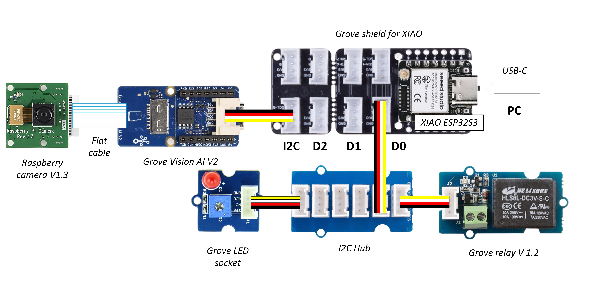
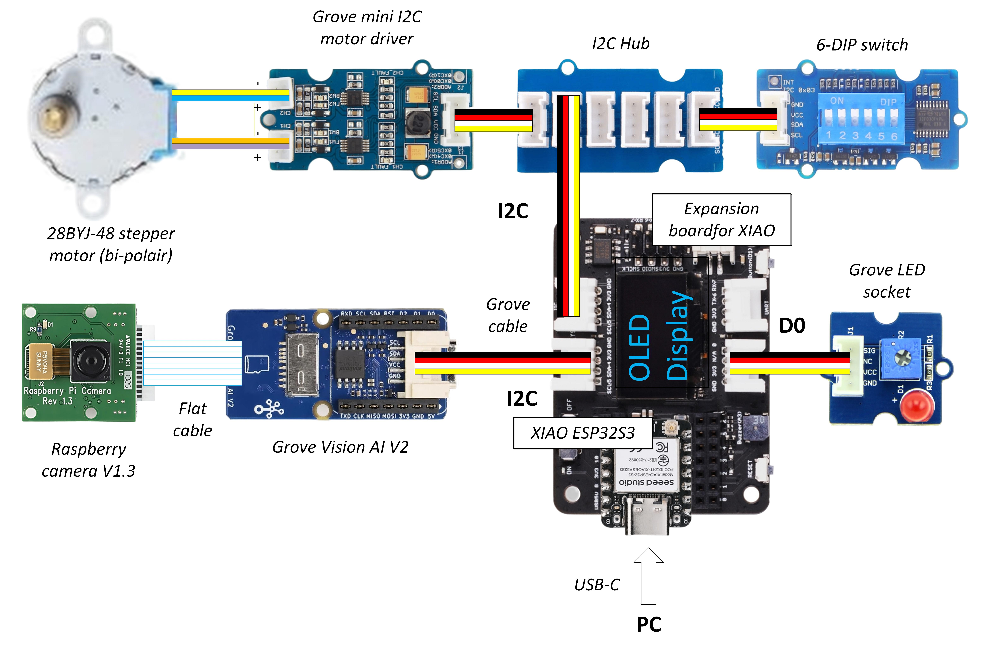
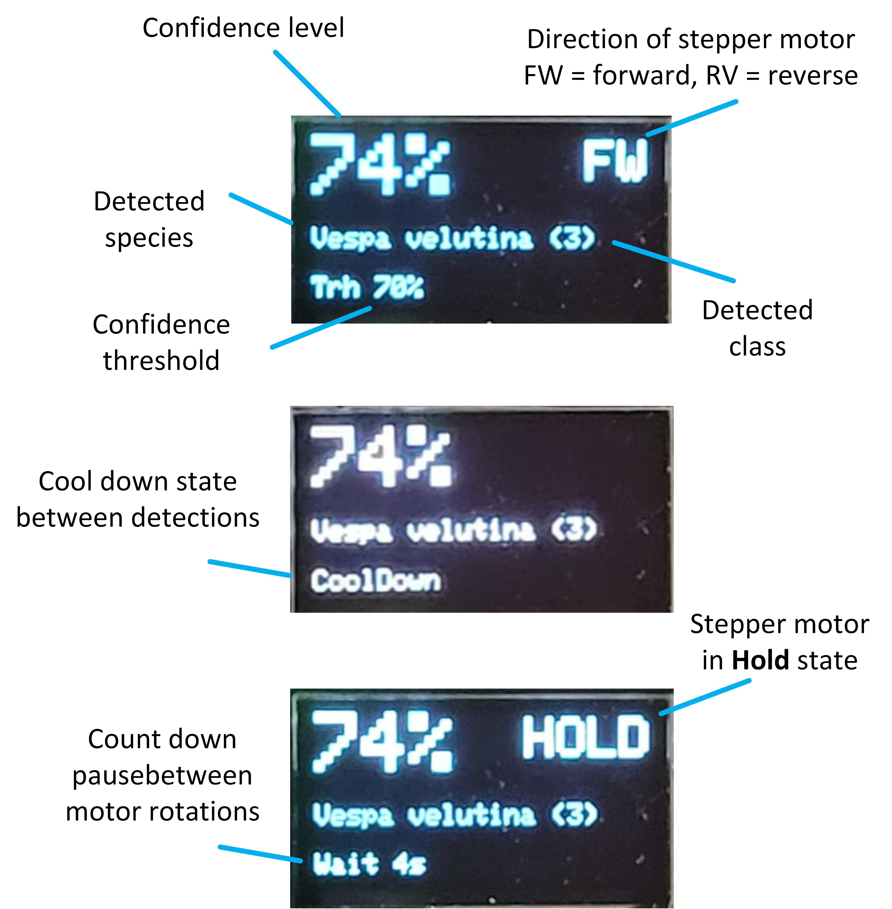
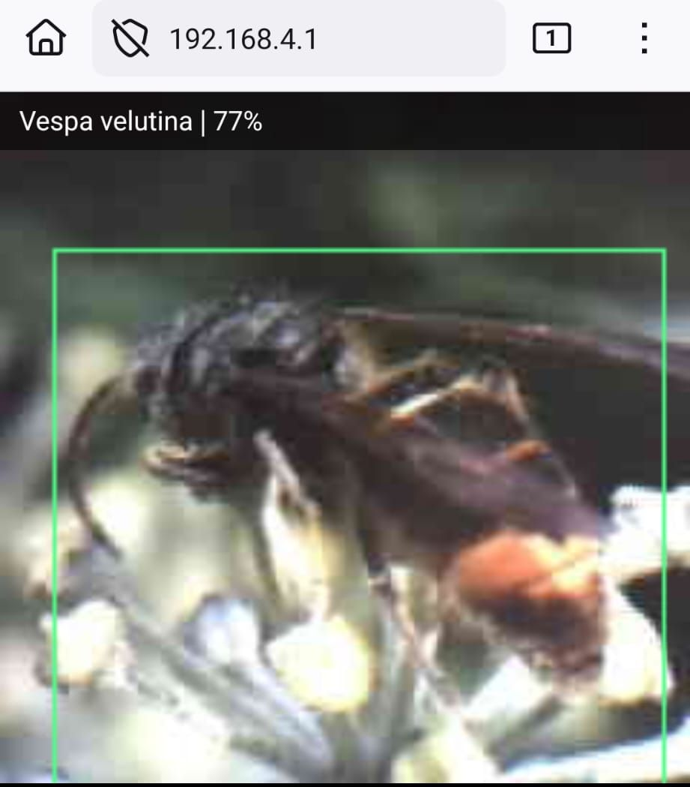
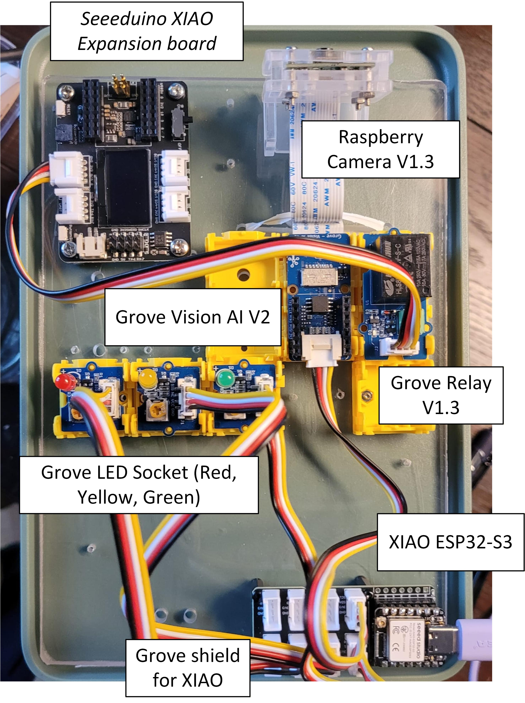

# Vespa Smart Trap – ONE

## **Plug & Play detection system for Vespa Velutina**

The **Vespa Smart Trap (VST – ONE)** is an affordable **plug & play detection system** designed to recognize **Asian hornets (Vespa velutina)** using **artificial intelligence and a camera**.

This version **VST-ONE** is a *Proof of Concept* of the Vespa Smart Trap project. It **detects hornets**, triggers simple actions (like switching a relay or LED), and forms the foundation for later versions that will include a physical trap, solar power, and mobile connectivity.

👉 **No soldering, no programming, no engineering skills required.**

All parts are off-the-shelf modules and the software is installed using simple web tools.
Full instructions are available in [VST-ONE Manual V2.3](doc/Vespa%20Smart%20Trap%20-%20ONE%20V2.3.pdf)

---
## What is this project?

This development make part of the project **Vespa Smart Trap (VST)** (in Dutch: *Slimme val Aziatische hoornaar*), an initiative of the beekeepers organization **Imkersvereniging Leiden e.o.** and technology partners, financed with help of **World Wildlife Fund - Innovation (WWF-INNO)**, **Rabobank Leiden-Katwijk** and a crowfundingcampaign on **WhyDonate**.

The aim of the project is developing a afforadable, smart, open-source trap. The trap uses artificial intelligence for automatic recognition and operates entirely without toxic substances. The trap is activated only after a positive identification of the Asian hornet — other insects remain unharmed.

---

## What does it do?

* Detects **Asian hornets (Vespa velutina)** using AI
* Works **fully offline** (no internet needed)
* Can trigger actions such as:

  * switching a relay
  * turning on LEDs
  * driving small motors
* Uses camera-based recognition instead of bait
* Designed for easy expansion and future upgrades
* Has web browser over WiFi inference image display

---

## How does it work? (Simple explanation)

1. A **camera** looks at insects passing by
2. A small AI computer analyzes the images
3. When a hornet is recognized, a signal is sent
4. The system activates outputs (relay, LED, motor, etc.)
5. A built-in web server sends out the image over a built is WiFi Access Point and accessible at http://192.168.4.1 

Everything happens **locally on the device**, without cloud services or subscriptions.

5V power suplly must be provided over USB-C.

---

## What is included in the VST-ONE version?

The VST-ONE station consists of **three main modules**:

* **Camera module** – captures images
* **Vision AI module** – recognizes hornets using AI
* **ESP32 control module** – handles outputs and extensions

All modules connect using 4-wire **Grove cables**.

Example using 3 relay/LED outputs:

You can use up to **three output channels** at the same time.

---

## Optional add-ons

You can connect optional modules depending on your use case:

* **Relays** – switch external devices (up to 230V / 10A)
* **LEDs** – visual warning or status indication
* **Motor driver** – drive small DC motors or stepper motors
* **I²C hub** – connect more sensors or modules

---

## Alternative expansion board

Grove connections with the XIAO require some extension board. The most simple is the Grove Shield for XIAO. ALternatively an expansion board with an OLED display can be used.

Example using a relay/LED output and a Stepper Motor with preset motions:

---

## What this ONE version does NOT include:

This repository focuses on the **VST-ONE only**.

Not included in this version:

* Physical hornet trap or enclosure
* Solar power, battery
* LTE-M / mobile communication
* SMS or internet messaging

These features are planned for the **VST-BASE** version, summer 2026.

---

## Software installation overview

There are **two devices** that need software:

1. Vision AI module (camera + AI)
2. ESP32 controller module

No coding is required.

---

## Step 1 – Install AI model on the Vision AI module

1. Connect the **Vision AI module** to your computer using USB-C
2. Open a browser and go to: [https://sensecraft.seeed.cc/ai/view-model/61707-vespa-velutina-detection](https://sensecraft.seeed.cc/ai/view-model/61707-vespa-velutina-detection)
3. No account is required
4. Follow instructions:
5. Click **Deploy model**
6. Click **Connect** and select the USB port
7. Click **Deploy** and wait a few minutes

After deployment:

* You should see live camera images
* Point the camera at a picture of an Asian hornet to test detection
* Optional: enable the onboard LED when detection exceeds a chosen confidence level

This completes the Vision AI setup.

---

## Step 2 – Install firmware on the ESP32 controller

1. Place the **XIAO ESP32-S3** into the Grove expansion board
2. Connect it to your computer using USB-C
3. Download the [ZIP file](https://github.com/aggerritsen/VespaSmartTrap-ONE/archive/refs/heads/main.zip) from:
   [https://github.com/aggerritsen/VespaSmartTrap-ONE/](https://github.com/aggerritsen/VespaSmartTrap-ONE/)   
4. Open the flashing tool:
   [https://espressif.github.io/esptool-js/](https://espressif.github.io/esptool-js/)
5. Click **Connect** and select the USB port
6. (Optional) Click **Erase Flash**
7. Add the following firmware files from zip file .pio/build/xiao-esp32s3/... :

| Flash Address | File           |
| ------------- | -------------- |
| 0x00000000    | bootloader.bin |
| 0x00008000    | partitions.bin |
| 0x00010000    | firmware.bin   |

8. Save settings are:
- Flash Mode: dio
- Flash Frequency: 80m
- Flash Size: 8MB

9. Click **Program** and wait until finished

10. **Disconnect**

This completes the ESP32 setup.

---

## OLED display
When using the XIAO Expansion board with an OLED display, real-time information is displayed.

A more fancy approach is the use of the provided web viewer, available over WiFi Open access point **VST-ONE-xxxxxx** and URL http://192.168.4.1 

---

## Error handling and timeouts

* **Vision AI I²C check**: the Vision AI module is probed on I²C before each inference.  
  If it is not detected, the OLED shows **FAULT** after a short timeout.

* **READY/FAULT timeout**: if no inference results are received for a period of time, the OLED switches to **READY** (Vision AI OK) or **FAULT** (Vision AI missing).  
  The timeout is configurable in `src/parameter.h`:
  `READY_FAULT_TIMEOUT_MS`

* **Transport timeouts** (UART): ACK timeouts trigger retries; after several failures, image transport pauses while inference continues.

---

## Bill of Materials (VST-ONE)

### Required parts

| Item                  | Approx. price |
| :--------------------- | ------------: |
| Camera module         | € 8            |
| Grove Vision AI V2    | € 19           |
| XIAO ESP32-S3         | € 9            |
| Grove cables          | € 1            |
| Grove shield for XIAO | € 5 |
| **Alternative shield:** | |
| *Arduino expander OLED* | *€ 17*|

**Total:** approx. **€42–55**

---
## Stepper motor

The firmware can drive a 28BYJ-48 (bipolar mod) through the Grove I2C Mini Motor Driver (DRV8830 x2).
When the AI detects the class mapped to `CLASS_LED1` (default: class 3, Vespa velutina), it triggers one full motor cycle and pauses inference during rotation to avoid I2C contention.

### Actuation gating (anti-flutter)

To avoid single-frame false positives, all actions (LEDs and motor) require multiple consecutive detections.
Configure in `src/parameter.h`:
`ACTUATION_REQUIRED_OCCURRENCES` (e.g., 1 = immediate, 2 = two consecutive frames, 3 = three frames).

### Motor presets (DIP switch)

The 6-position DIP switch sets **direction**, **angle**, and **wait time** using 2 bits each:

* **Direction (S1–S2)**  
  00 = CCW only  
  01 = CW only  
  10 = CCW → CW  
  11 = CW → CCW  

* **Angle (S3–S4)**  
  00 = 90°  
  01 = 180°  
  10 = 360°  
  11 = 720°  

* **Wait time (S5–S6)**  
  00 = 0 s  
  01 = 6 s  
  10 = 30 s  
  11 = 60 s  

**Example**: S1..S6 = `010110`  
Direction = 01 (CW only), Angle = 01 (180°), Wait = 10 (30 s)

### Defaults when DIP is missing

If the Grove Multi Switch probe fails, the firmware uses these defaults:

* Direction: **CW → CCW**
* Angle: **720°**
* Wait: **60 s**

## 6-DIP switch module
Libary: https://github.com/Seeed-Studio/Grove_Multi_Switch
The DIP switch is now used to configure motor direction, angle, and timing (see presets above).

---

### Optional parts

* Grove relays
* Grove LEDs (red/green/blue/yellow)
* Grove motor driver
* Grove I²C hub
* Motors, switches, mounting hardware
* Acrylic plate with wrapper, see [Drilling Plan](doc/DrillingPlanSmartTrap.pdf)

Choose only what you need.

---

## Advanced users
Can adjust .cpp programs for which config file for the use of *Platformio* are provided. Code is using general available *Arduino* and *SSCMA* libraries.

### Monitoring (optional)

You can view system messages if the ESP32 is connected to a computer:

* Use a serial terminal (e.g. PuTTY)
* Select the correct COM port
* Set baud rate to **921600**
* Enable "Implicit CR in every LF"

or use *platformio* monitor tools

---

## Project status

This is an **active development project**.

* **VST-ONE** station: ✔ functional *proof of concept*
* **VST-BASE** version (solar + LTE-M + Physical trap enclosure): planned, spring 2026

---

## License

This project is released under the **GNU Public License**.

You are free to:

* Use it
* Modify it
* Share it

As long as you keep it open-source.

---

## Who is this for?

* Beekeepers
* Local authorities
* Nature conservation projects
* Citizen science initiatives
* Anyone wanting a **non-toxic, intelligent hornet detection system**

---

If you have questions, ideas, or want to contribute — feel free to open an issue or discussion on GitHub, or send an email to ah-val@imkersleiden.nl
